#####	Date: 29-06-2026

#####	Author: Ebenezer Ayo, Oneybuchi.

#	Raytracing Polygons - Python Moderngl

+	Demonstrates rendering of polygons using raytracing and the optimization using a Bounding Volumne Hierarchy structure, BVH.

+	The use of a Bounding Volumne Hierarchy significantly improves performance by drastically reducing the number of ray-triangle misses during the calculation for intersection between the ray and the triangles of the Polygon Mesh.
	-	This is possible as the BVH structure pre-partitions the rendering space into equal parts recursively. 
	-	When a ray is fired, what outer partitions it hits is tested, and then is tested against the subdivided partitions within that outer partition, and so on. Therefore the ray intersection is only for the outer most, reducing checking the whole screen space everytime. If it doesn't fall within the first outer bounding partition, it goes to the next, skipping that whole screen search space early. This is what reduces the overhead.


### Github Repo:
[`Git Repo`](https://github.com/OnyebuchiDeji/Raytracing_Polygons_Pypy)


###	Key Features

+	GPU-accelerated rendering using the rendering pipeline.
+	SDF raytracing for visualising Polygon Meshes
+	Performance improvement using Bounding Volume Hierarchy structure.
+	Use of strucutres like SSBOs- (Shader Storage Buffer Objects) to send the Polygon triangle data to GPU.

###	Tech Stack

+	Python, Moderngl, Pygame, PyGLM

---


###	Setup Instruction
>	Install Python
>	Install Pip
>	Install Make either by msys64, on wsl, or Linux environment
1.	Create & Activate Environment:
	-	`python -m venv .venv`
	-	`.venv\Scripts\activate.bat`
2.	Install Dependencies:
	-	`pip install -r requirements.txt`
3.	Run (in root directory):
	-	`make` or `make app`
	+	Or Run using Python if can't install Make:
	-	`python src/main.py`

---

###	Architecture Diagram

```
Raytracing_Polygons_Pypy/
 ├── src/
 │	├── __init__.py
 │	├── vertex.py
 │	├── utils.py
 │	├── shader.py
 │	├── programs/
 │	├── _program.py
 │	├── shaders/
 │	│	├── program5.vert
 │	│	├── program5.frag
 │	│	├── program4b.frag
 │	│	├── program4.vert
 │	│	├── program4.frag
 │	│	├── program3.vert
 │	│	├── program3.frag
 │	│	├── program2b.frag
 │	│	├── program2.vert
 │	│	├── program2.frag
 │	│	├── program1c.frag
 │	│	├── program1b.frag
 │	│	├── program1.vert
 │	│	└── program1.frag
 │	├── program5.py
 │	├── program4.py
 │	├── program3.py
 │	├── program2.py
 │	└── program1.py
 │	├── model_reader.py
 │	├── model.py
 │	├── engine.py
 │	├── config.py
 │	├── camera.py
 │	├── bvh.py
 │	└── app.py
 ├── README.md
 ├── models/
 │	├── wall.obj
 │	├── tank.obj
 │	├── ground.obj
 │	├── deino.obj
 │	├── cube.obj
 │	└── baryonx.obj
 ├── Makefile
 ├── .pddignore
 └── .gitignore
```

###	Screenshots

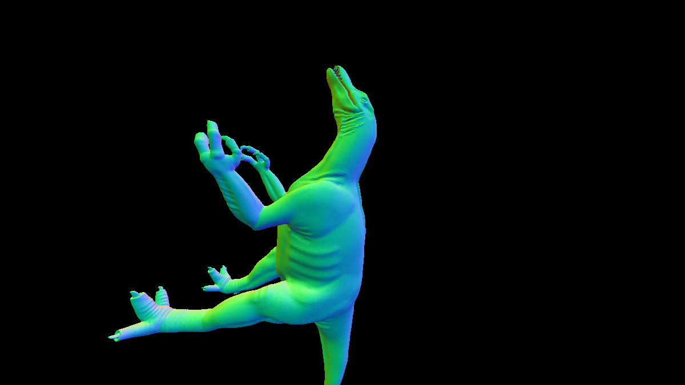
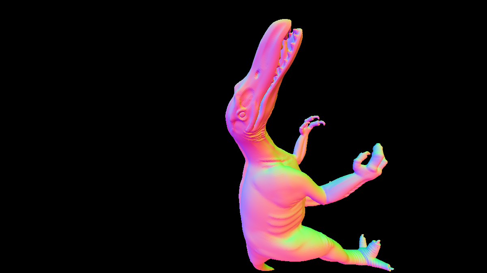
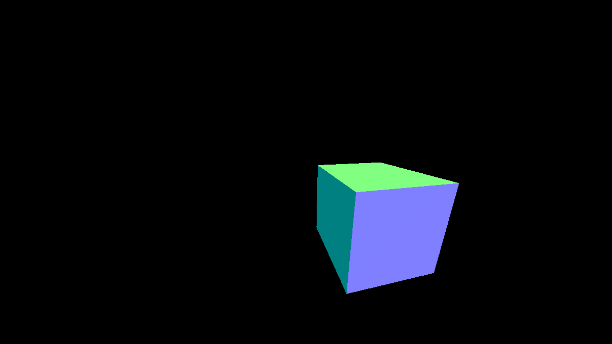
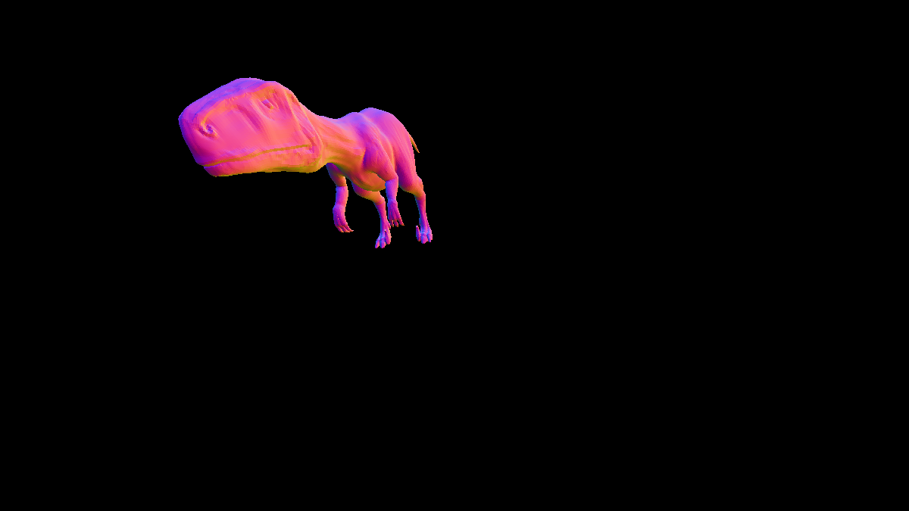
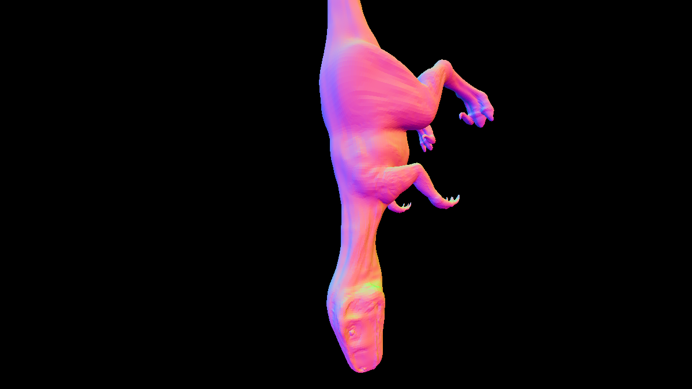
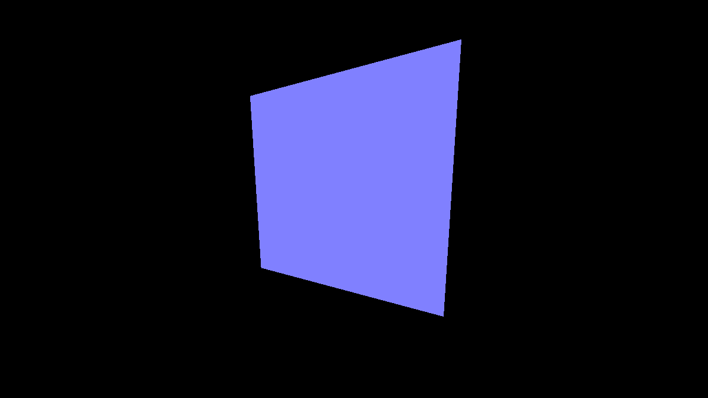
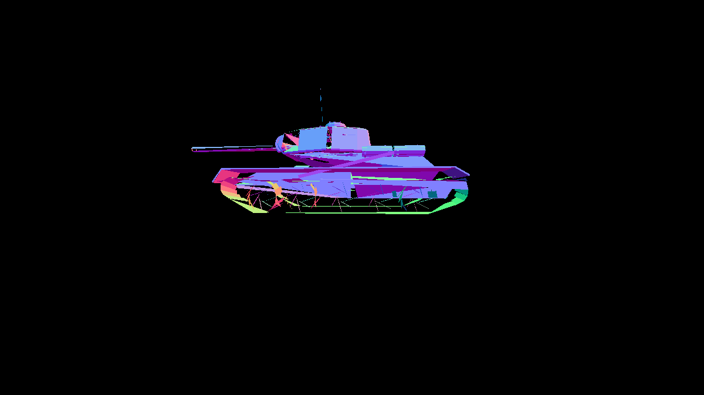
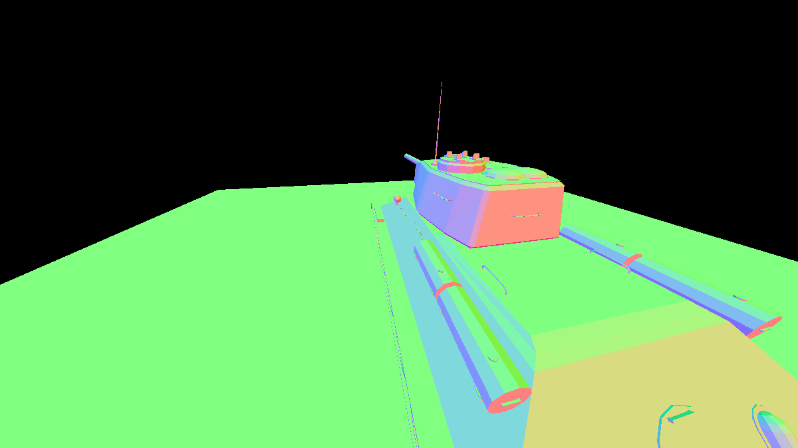
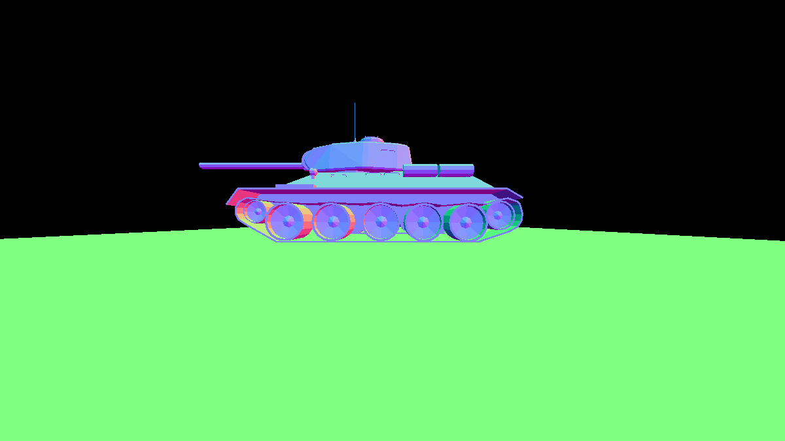
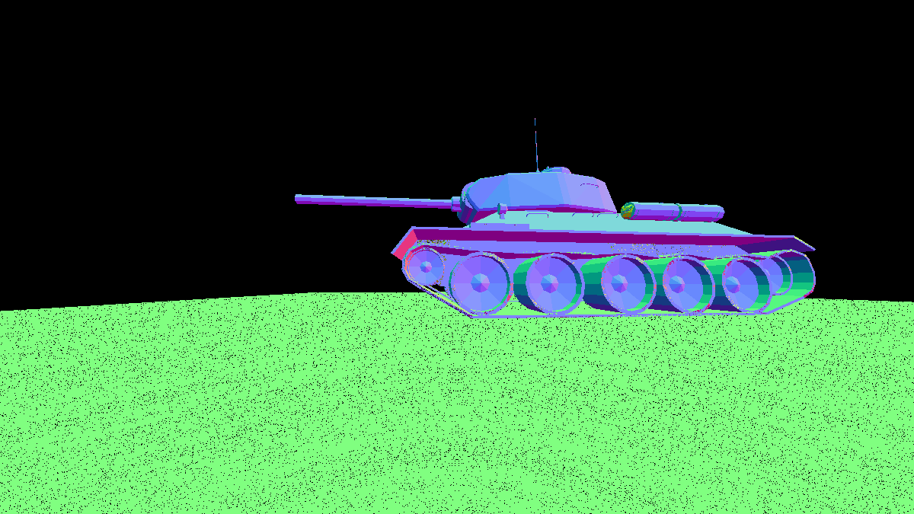
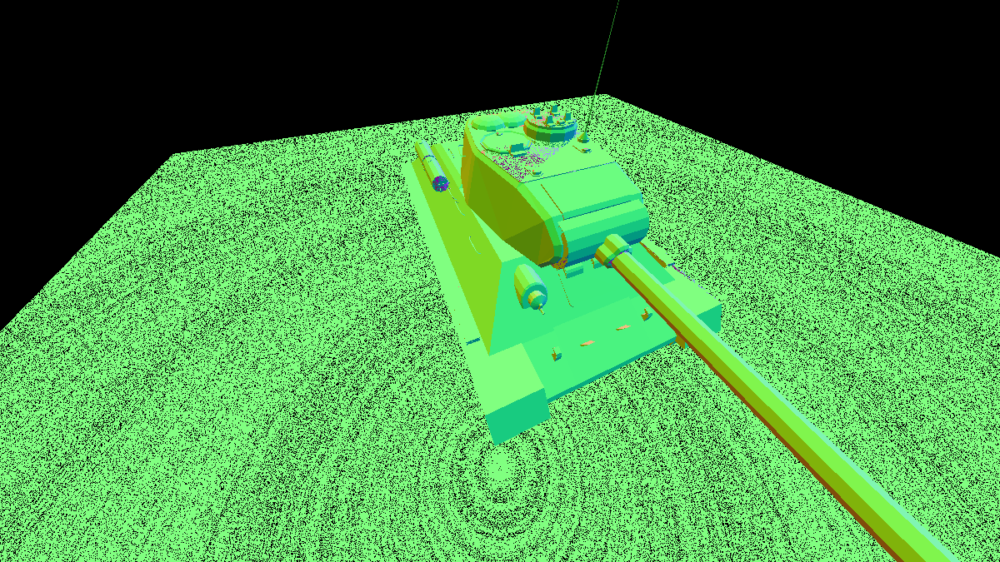

---